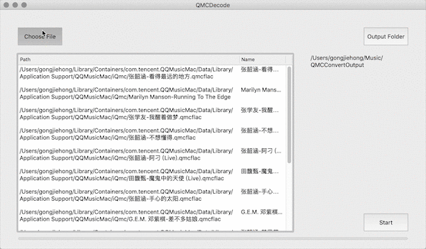

# QMCDecode

QQ音乐QMC格式转换为普通格式，仅支持macOS，可自动识别到QQ音乐下载目录，默认转换结果存储到~/Music/QMCConvertOutput

可自定义需要转换的文件和输出路径

转换后tag不对可以使用[kid3](https://prdownloads.sourceforge.net/kid3/kid3-3.8.0-Darwin.dmg?download)进行修改, 支持批量

支持的格式如下

* .qmcflac to flac
* .qmc0 to mp3
* .qmc3 to mp3

----
示例

协议与许可

MIT